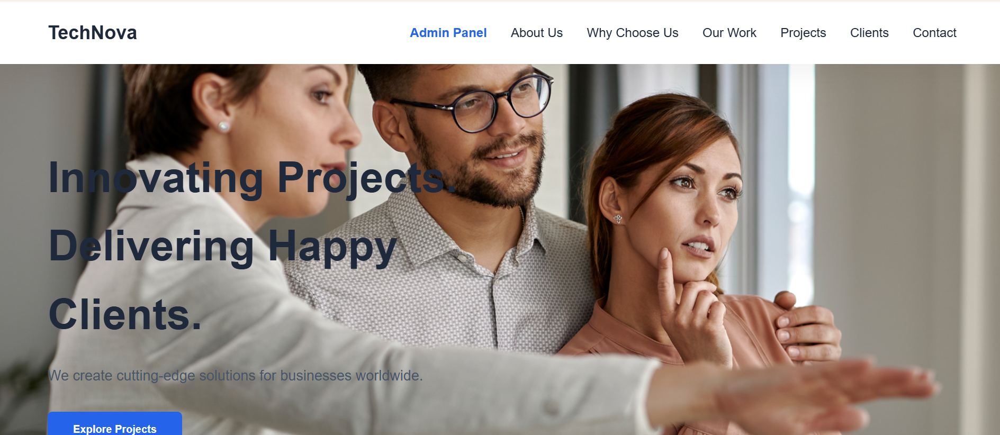
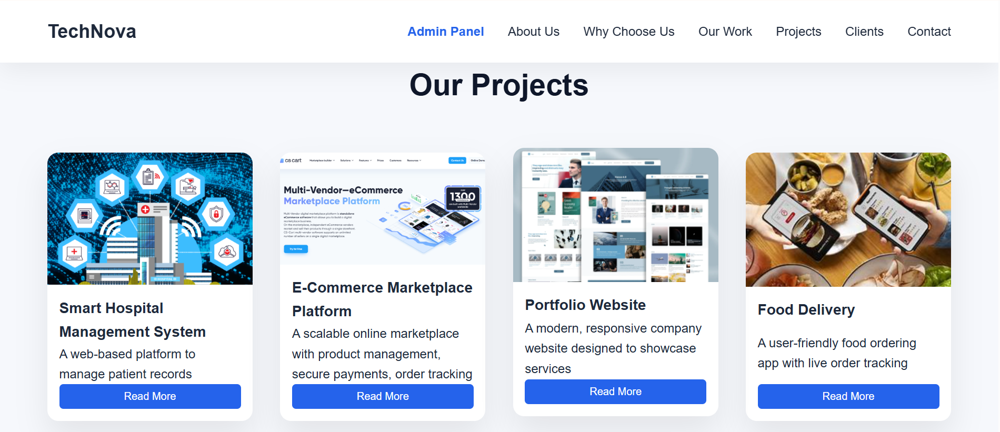
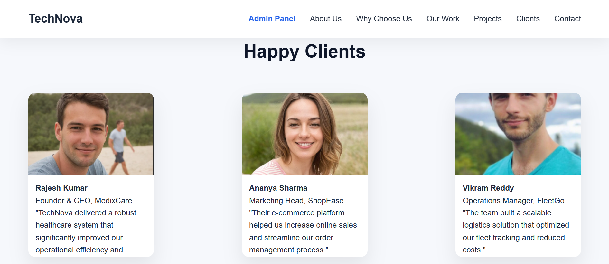
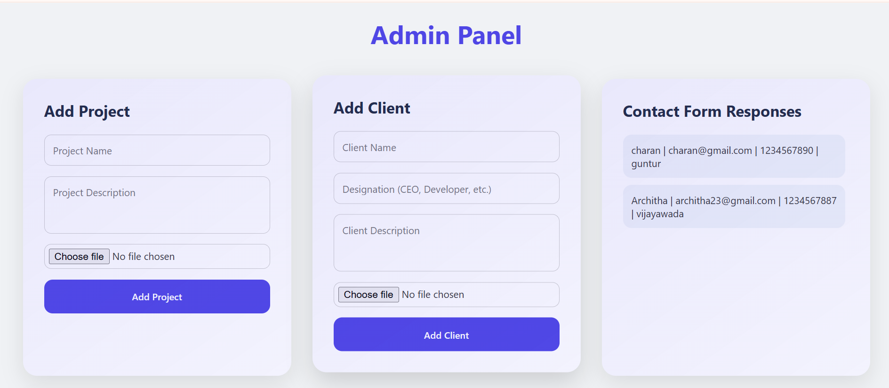
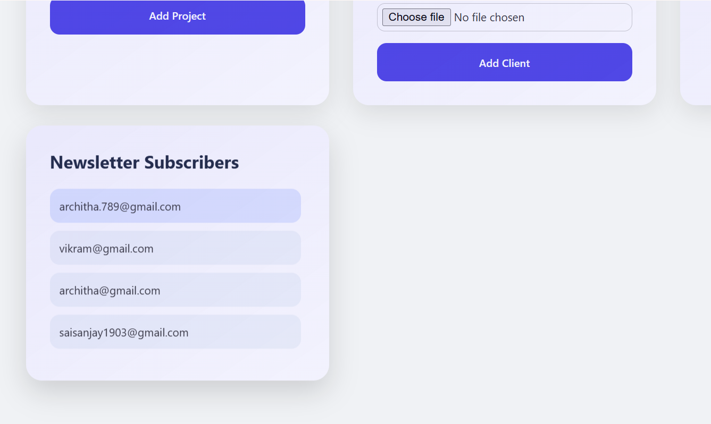
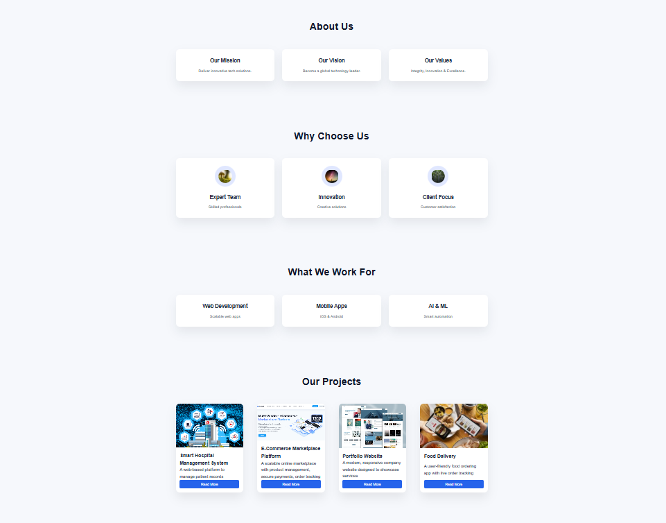

Full Stack Assignment
Live link : https://fascinating-concha-27badd.netlify.app/

Project Overview
This is a full‑stack web application built as part of a placement assignment. It consists of:

A Landing Page for users to view projects, clients, submit contact forms, and subscribe to a newsletter.

An Admin Panel for managing projects, clients, contact form submissions, and newsletter subscriptions.

All dynamic data is fetched from the backend using REST APIs. No static data is hardcoded on the frontend.

**Output Screenshots:**

Features

Landing Page

Our Projects – Displays projects fetched from backend

Project Image

Project Name

Project Description

Dummy “Read More” button

Happy Clients – Displays clients fetched from backend

Client Image

Client Name

Client Designation

Client Description

Contact Form

Full Name

Email Address

Mobile Number

City

Submits data to backend and stores in database

Newsletter Subscription

Email subscription

Stores subscribed emails in database

Admin Panel

Project Management

Add project image, name, and description

Client Management

Add client image, name, description, and designation

Contact Form Responses

View all user contact submissions

Newsletter Subscriptions

View all subscribed email addresses

Tech Stack

Frontend,HTML,CSS,JavaScript,Fetch API

Backend

Node.js,Express.js,MongoDB

API Endpoints

Method	Endpoint	Description

GET	/api/projects	Fetch all projects

POST	/api/projects	Add a new project

GET	/api/clients	Fetch all clients

POST	/api/clients	Add a new client

GET	/api/contacts	View contact form submissions

POST	/api/contacts	Submit contact form

GET	/api/newsletter	View subscribed emails

POST	/api/newsletter	Subscribe email

How to Run Locally

Backend:

cd backend

npm i

node server.js

Front end:

open index.html and run for landing page 

open admin.html and run for admin page 

The project includes a dedicated Admin Panel accessible via the “Admin Panel” option in the navigation bar.
Admin users can manage Projects, Clients, Contacts, and Newsletter subscriptions.
The admin interface is intentionally separated from the public UI to follow real-world access control practices.

Database:

MongoDB

Collections:

Projects

Clients
Contacts
Newsletter
